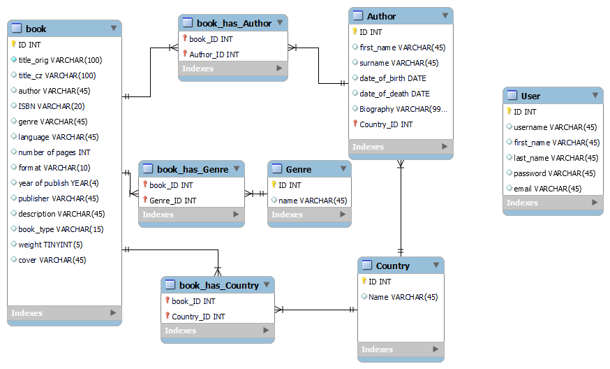

# Project Digital Library

## Project description
Digital Library is an application developed in Django in Python, which will allow user to 
search, filter, sort books in SQLite database, get information on Authors and their biography.
It allows users with specific rights to add/edit/delete books, insert comments to books which
will serve other readers as recommendations.

## Main Functionalities:

### User registration and login
- `users are able to create accounts, log in into accounts and log out`
- `different levels of user rights to distinguish between "read-only" user and "librarian"
who is able to add/delete/edit books/authors`

### Book administration

- `add, delete, edit books in database`
- `add, delete, edit authors in database`
- `api to heureka - user can see where to buy the book and for what price`

### Book ratings and reviews

- `users are able to write their own ratings and reviews to books`

## Technologies used
- `BACKEND`
  - `Python`
  - `Django`
  
- `DATABASE`
  - `SQLite`
  
- `FRONTEND`
  - `HTML`
  - `CSS`
  - `JavaScript`

- `Git and GitHub`

## Entity-Relationship Diagram

- `List of books`(ISBN, genre, language, 
number of pages, format, date of publish, publisher, description, 
book case, weight, translation, rating)

- `Book detail`
- `sort books by:`
  - `name`
  - `year of publish`
  - `rating`
  - `number of pages`
    
- `books filters:`
  - `genre`
  - `origin`
  - `author`
  - `rating`
  - `translation`
  - `price`
  
  - `book rating - good to have`
  - `insert, edit and delete books`
      - `form`
      - `user rights`
  - `insert, edit and delete authors`
      - `form`
      - `user rights`
  - `information about author`
  - `search`
  - `book suggestions - good to have`
  
## Database

### Models
- [] genre
  - [] name
  - [] books -> ManyToMany(book)
- [] user
  - [] username
  - [] first_name
  - [] last_name
  - [] password
  - [] email
  - [] phone number (CZ)
- [] review
  - [] comment
  - [] rating
  - [] recommendation
  - [] reviewer -> ForeignKey(Profile)
  - [] book -> ForeignKey(book)
- [] country
  - [] name
  - [] books -> ManyToMany(book)
- [] author
  - [] first_name
  - [] surname
  - [] date_of_birth
  - [] date_of_death
  - [] country -> ForeignKey(country)
  - [] author -> ManyToMany(book) - books author wrote
  - [] biography (life)
- [] book
  - [] title_orig
  - [] title_cz
  - [] author -> ManyToMany(book)
  - [] ISBN
  - [] genre
  - [] language (original)
  - [] number of pages
  - [] format
  - [] year of publish
  - [] publisher
  - [] description
  - [] book case
  - [] weight
  - [] review
  - [] cover
  - [] where to buy (good to have, heureka api - https://sluzby.heureka.cz/napoveda/marketplace-api/)
  

